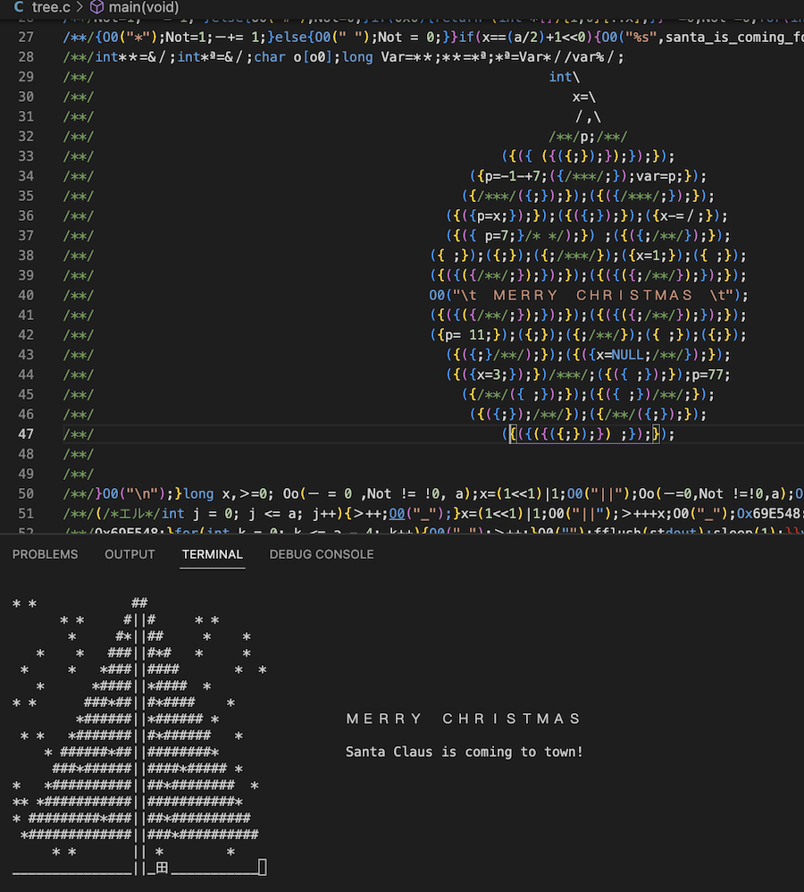

### terminal art christmas tree  
Generates a tree of a random height and generates little animated snowflakes. Also decides whether or not Santa Claus will be coming to town for christmas. Also the code is obfuscated and shaped like the branch of a Christmas Tree.  




Includes abusive lines such as:
``` 
var var = var; VAR = var;
int *＊=&var;int*$=&VAR;long Var=*＊;*＊=*$;*$=Var/7; 
``` 
and  
```
if (NUL)<%O0("*");Not =a+++1-a++-0;ー-=-1;}
```

